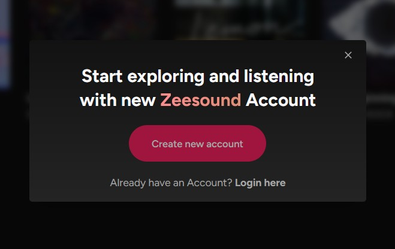

<h1>Zeesound</h1>

 
  

    
  

Made with:

  
  
  
  
  

 
<h3>
  About the Project
</h3>

Simple Music hub that let User upload and listen to their own song or playlist (def not Spotify Clone).
